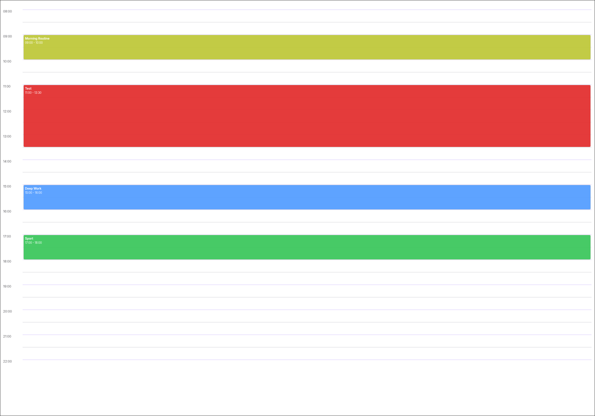
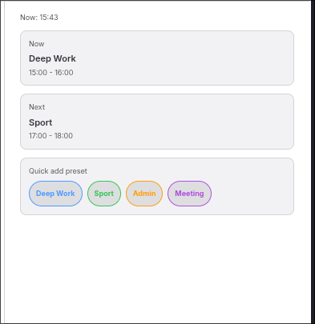

# Timeboxing for Obsidian

Daily-note-first timeboxing view for Obsidian, with a central planning canvas and a compact sidebar monitor.

## Screenshots

### Main timeboxing view



### Right sidebar monitoring view



## Highlights

- Daily note as single source of truth (auto-created if missing).
- Timeline with dynamic range (default 08:00–22:00, auto-extends when needed).
- Overlap-aware layout (concurrent tasks are displayed side by side).
- Click a time slot to create a task.
- Click a task block to edit name, time range, and color.
- Presets (name + color) for fast task creation.
- Compact right-sidebar mode with **Now / Next** monitoring.
- One-click **Start** action in compact mode (`- [ ]` -> `- [/]` + `started_at`).
- Live refresh when the daily note changes.

## Task format

The plugin reads Markdown tasks from the current daily note:

```md
- [ ] Deep work [start:: 09:00] [end:: 11:00]
- [/] Review PRs [start:: 11:00] [end:: 11:30] [color:: #ff9f0a]
```

Supported fields:

- Required: `[start:: HH:mm]`, `[end:: HH:mm]`
- Optional: `[color:: #RRGGBB]`
- Internal (managed by plugin): `[tbid:: ...]`
- Any other inline Dataview fields are preserved.

## Commands

- `Open Timebox`: open the main timeboxing view.
- `Open timebox in right sidebar`: open compact monitoring view.

## Settings

- **Time slot step**: `15` or `30` minutes.
- **Task presets**: configure preset name + color for quick creation.

## Quick start

1. Run **Open Timebox**.
2. Click on a timeline slot to create a task.
3. Edit by clicking an existing task block.
4. Open **Open timebox in right sidebar** for compact monitoring.
5. Use **Start** on `Now` or `Next` from the sidebar when you begin working.

## Installation

### Community plugins (once published)

1. Open **Settings -> Community plugins**.
2. Search for **Timeboxing**.
3. Install and enable.

### Manual

1. Build or download release assets.
2. Copy `main.js`, `manifest.json`, `styles.css` into:

```text
<Vault>/.obsidian/plugins/timeboxing/
```

3. Reload Obsidian and enable **Timeboxing**.

## Development

Requirements:

- Node.js 18+
- npm

Commands:

```bash
npm install
npm run dev
npm run lint
npm run test
npm run build
```

## Release process

1. Bump version in `manifest.json` and `package.json`.
2. Update `versions.json`.
3. Build release assets with `npm run build`.
4. Create GitHub release with tag matching the version (for example `1.1.0`).
5. Attach `main.js`, `manifest.json`, `styles.css` as release assets.

## Privacy and scope

- Local-first plugin.
- No telemetry.
- No external service required for core functionality.

## License

0BSD
